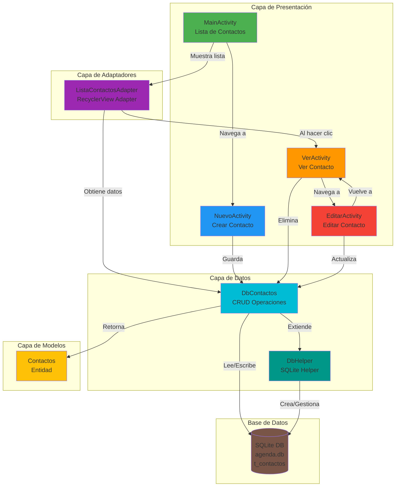
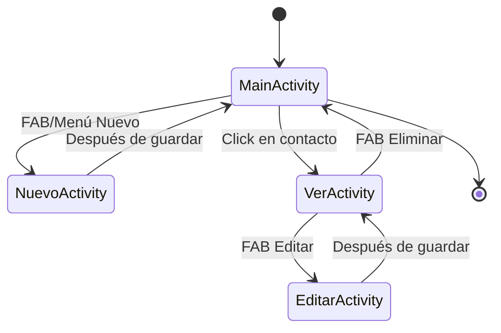
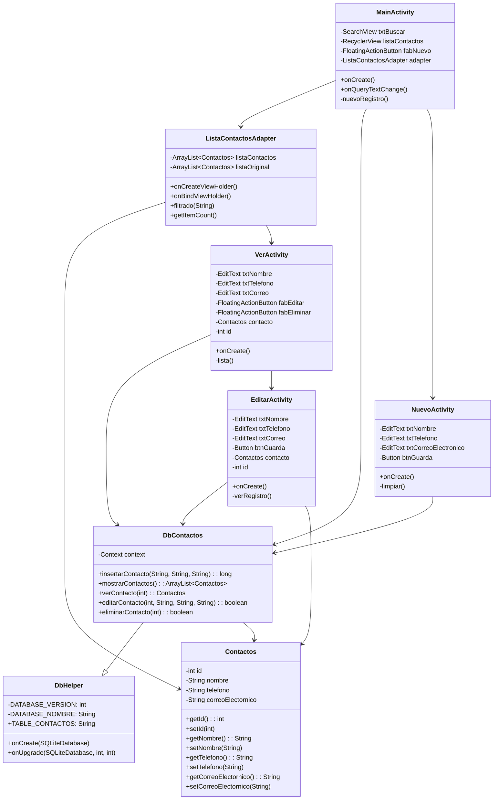
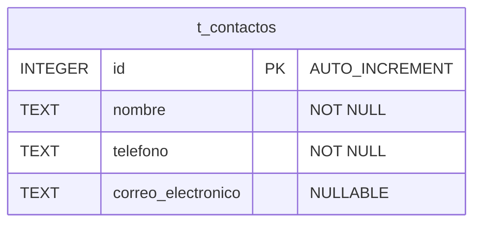
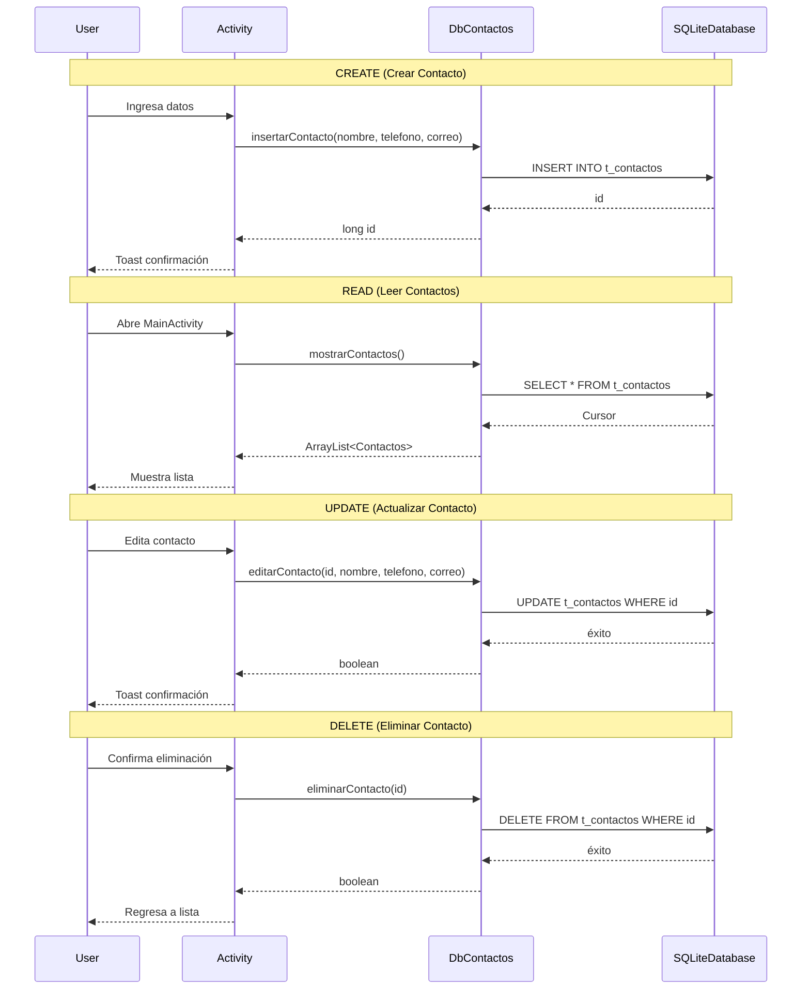
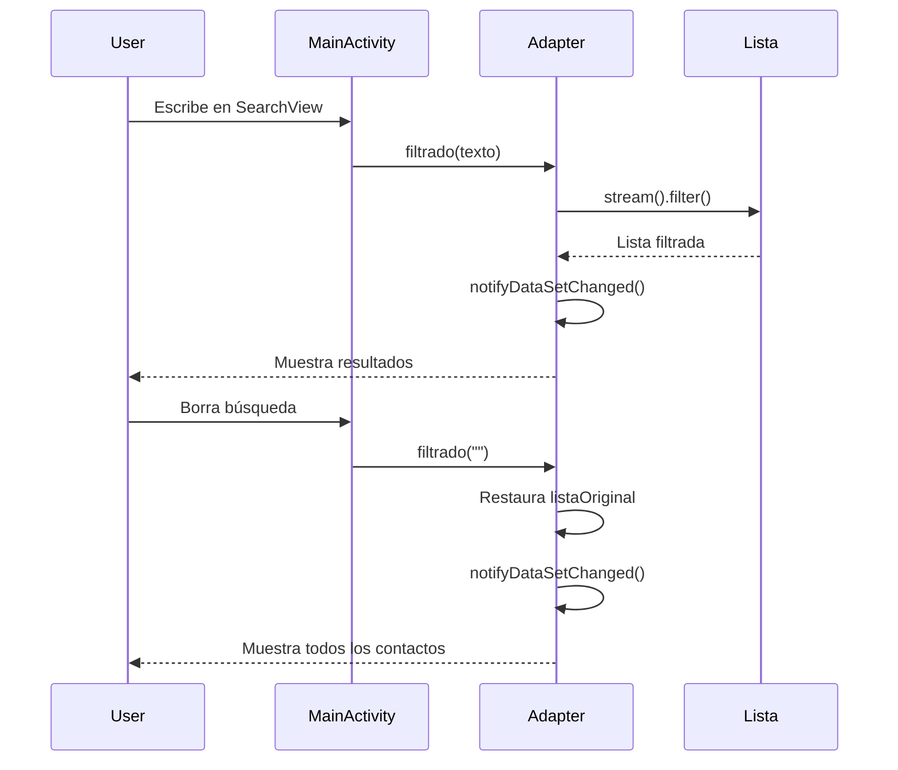

# Esquema de Arquitectura - Aplicación Agenda de Contactos

## Diagrama de Arquitectura General

## Flujo de Navegación entre Activities

## Diagrama de Clases

## Estructura de Base de Datos

## Operaciones CRUD

## Funcionalidad de Búsqueda

## Resumen de Componentes

### Activities
- **MainActivity**: Pantalla principal con RecyclerView, SearchView y FAB para crear contactos
- **NuevoActivity**: Formulario para agregar un nuevo contacto
- **VerActivity**: Muestra los detalles del contacto (solo lectura) con opciones para editar/eliminar
- **EditarActivity**: Formulario para modificar un contacto existente

### Adaptadores
- **ListaContactosAdapter**: Gestiona la visualización de contactos en RecyclerView con funcionalidad de filtrado

### Capa de Datos
- **DbHelper**: Extiende SQLiteOpenHelper, crea y gestiona la base de datos
- **DbContactos**: Extiende DbHelper, implementa operaciones CRUD

### Modelo
- **Contactos**: Entidad con campos id, nombre, telefono, correoElectornico

### Base de Datos
- **agenda.db**: Base de datos SQLite versión 2
- **t_contactos**: Tabla con campos id, nombre, telefono, correo_electronico
