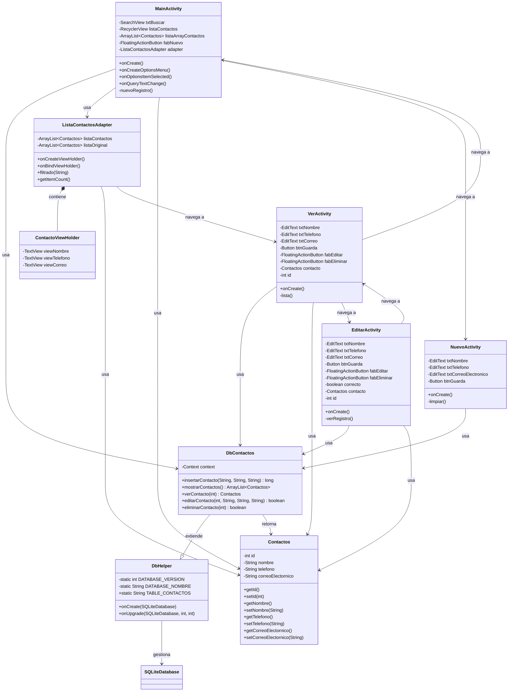
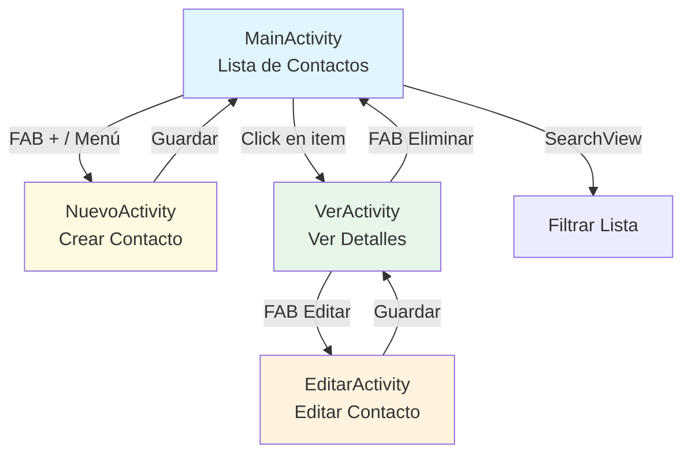
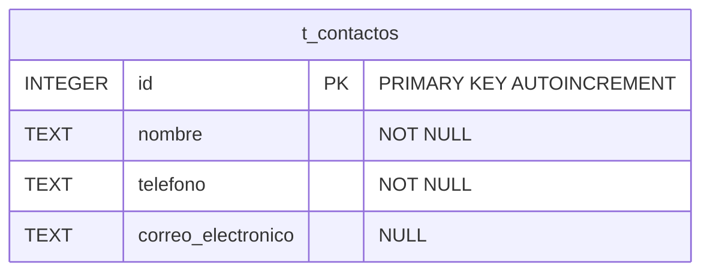
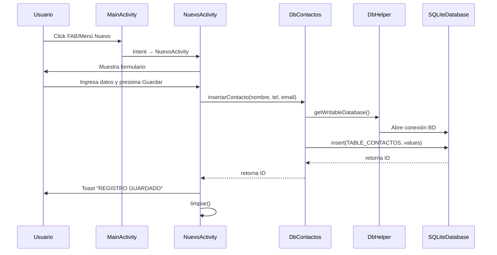
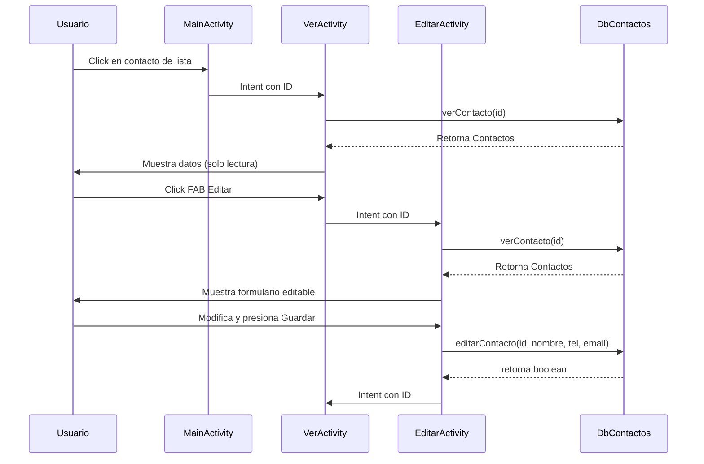
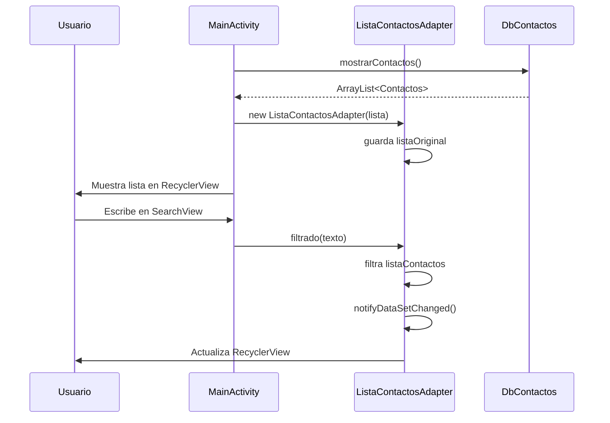
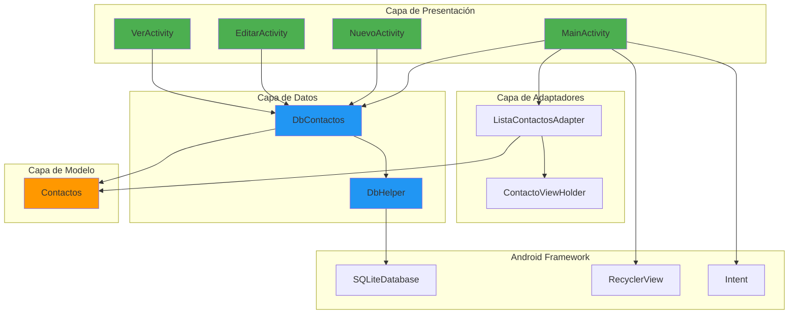

# 📱 Diagrama de Arquitectura - Aplicación Agenda de Contactos

## 🏗️ Diagrama de Clases y Relaciones



## 📊 Diagrama de Flujo de Navegación



## 🗄️ Diagrama de Base de Datos



## 🔄 Diagrama de Secuencia - Crear Contacto



## 🔄 Diagrama de Secuencia - Ver y Editar Contacto



## 🔄 Diagrama de Secuencia - Filtrar Contactos



## 📦 Estructura de Paquetes

```
com.cdp.agenda
│
├── 📱 Activities
│   ├── MainActivity.java          (Lista de contactos + búsqueda)
│   ├── NuevoActivity.java         (Crear nuevo contacto)
│   ├── EditarActivity.java        (Editar contacto existente)
│   └── VerActivity.java           (Ver detalles de contacto)
│
├── 🎨 adaptadores
│   └── ListaContactosAdapter.java (Adaptador RecyclerView)
│
├── 🗄️ db
│   ├── DbHelper.java              (Helper SQLite - creación BD)
│   └── DbContactos.java           (CRUD de contactos)
│
└── 📋 entidades
    └── Contactos.java             (Modelo de datos)
```

## 🎯 Patrones de Diseño Identificados

### 1. **DAO (Data Access Object)**
- `DbContactos` actúa como DAO para la entidad `Contactos`
- Encapsula todas las operaciones CRUD

### 2. **ViewHolder Pattern**
- `ContactoViewHolder` dentro de `ListaContactosAdapter`
- Optimiza el rendimiento del RecyclerView

### 3. **Singleton Database Helper**
- `DbHelper` extiende SQLiteOpenHelper
- Gestión centralizada de la base de datos

### 4. **MVC (Model-View-Controller)**
- **Model**: `Contactos`, `DbContactos`, `DbHelper`
- **View**: Layouts XML (activity_main.xml, etc.)
- **Controller**: Activities (MainActivity, etc.)

## 🔑 Funcionalidades Principales

| Funcionalidad | Implementación |
|---------------|----------------|
| ✅ Crear contacto | `NuevoActivity` → `DbContactos.insertarContacto()` |
| 📋 Listar contactos | `MainActivity` → `DbContactos.mostrarContactos()` |
| 👁️ Ver contacto | `VerActivity` → `DbContactos.verContacto()` |
| ✏️ Editar contacto | `EditarActivity` → `DbContactos.editarContacto()` |
| 🗑️ Eliminar contacto | `VerActivity` → `DbContactos.eliminarContacto()` |
| 🔍 Buscar contacto | `MainActivity` → `ListaContactosAdapter.filtrado()` |

## 📊 Diagrama de Componentes Android



## 🔐 Base de Datos SQLite

### Tabla: t_contactos

| Campo | Tipo | Restricciones |
|-------|------|---------------|
| id | INTEGER | PRIMARY KEY AUTOINCREMENT |
| nombre | TEXT | NOT NULL |
| telefono | TEXT | NOT NULL |
| correo_electronico | TEXT | NULL |

### Operaciones CRUD

```sql
-- CREATE
INSERT INTO t_contactos (nombre, telefono, correo_electronico) VALUES (?, ?, ?);

-- READ ALL
SELECT * FROM t_contactos ORDER BY nombre ASC;

-- READ ONE
SELECT * FROM t_contactos WHERE id = ? LIMIT 1;

-- UPDATE
UPDATE t_contactos SET nombre = ?, telefono = ?, correo_electronico = ? WHERE id = ?;

-- DELETE
DELETE FROM t_contactos WHERE id = ?;
```

---

## 📝 Resumen de Arquitectura

La aplicación sigue una arquitectura en capas:

1. **Capa de Presentación**: 4 Activities que manejan la interfaz de usuario
2. **Capa de Adaptadores**: RecyclerView adapter para la lista de contactos
3. **Capa de Acceso a Datos**: DbContactos (DAO) y DbHelper (SQLite)
4. **Capa de Modelo**: Entidad Contactos (POJO)

La navegación entre Activities se realiza mediante Intents, y los datos se persisten en SQLite usando el patrón DAO.
