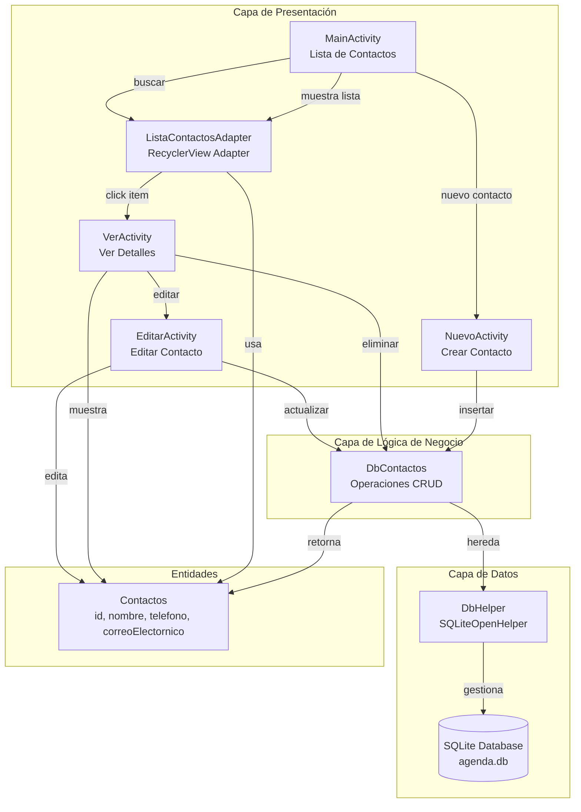
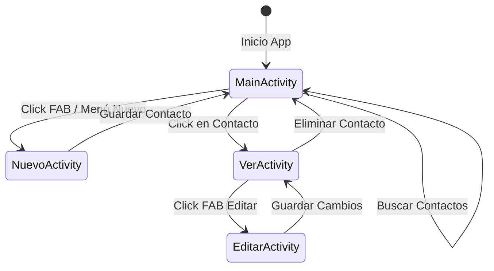
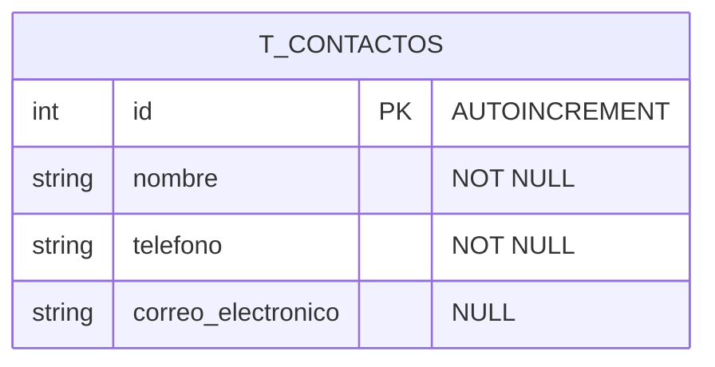
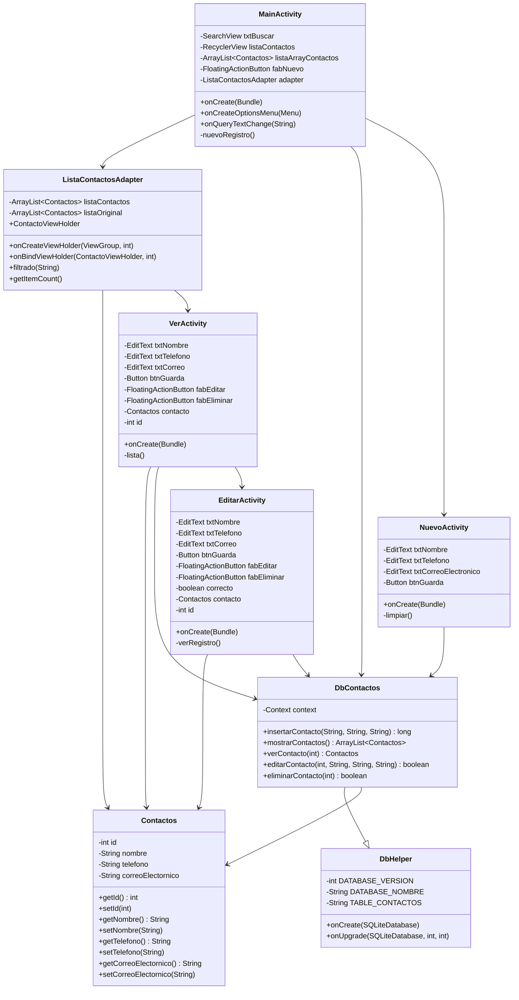
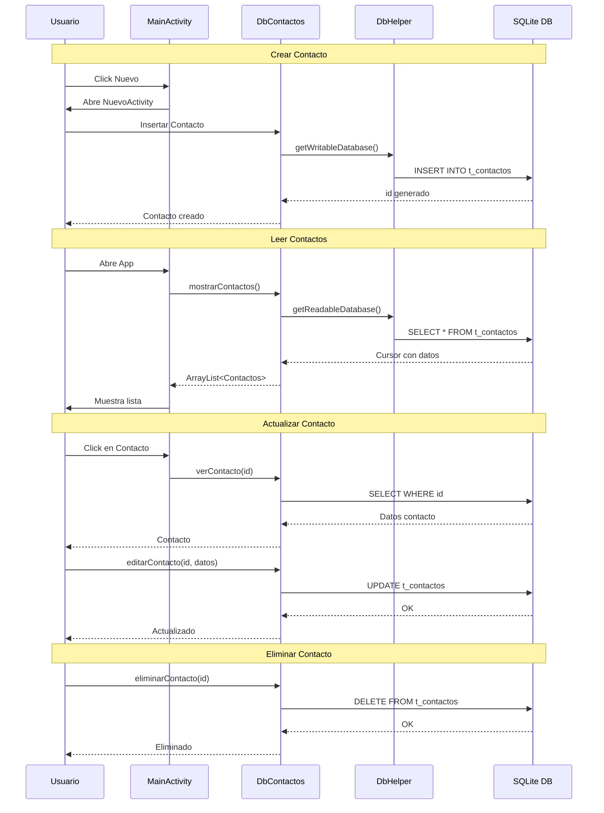

# Esquema de la Aplicación Agenda de Contactos

## Diagrama de Arquitectura

## Flujo de Navegación entre Actividades

## Estructura de Base de Datos

## Diagrama de Clases

## Operaciones CRUD

## Descripción de Componentes

### Actividades
- **MainActivity**: Pantalla principal que muestra la lista de contactos en un RecyclerView con funcionalidad de búsqueda
- **NuevoActivity**: Formulario para crear nuevos contactos
- **VerActivity**: Muestra los detalles de un contacto en modo solo lectura con opciones para editar o eliminar
- **EditarActivity**: Permite modificar los datos de un contacto existente

### Base de Datos
- **DbHelper**: Extiende SQLiteOpenHelper, gestiona la creación y actualización de la base de datos
- **DbContactos**: Extiende DbHelper, contiene todas las operaciones CRUD (Create, Read, Update, Delete) para los contactos

### Entidades
- **Contactos**: Modelo de datos con los campos: id, nombre, telefono, correoElectornico

### Adaptadores
- **ListaContactosAdapter**: Adaptador para el RecyclerView que muestra la lista de contactos e implementa filtrado por nombre
