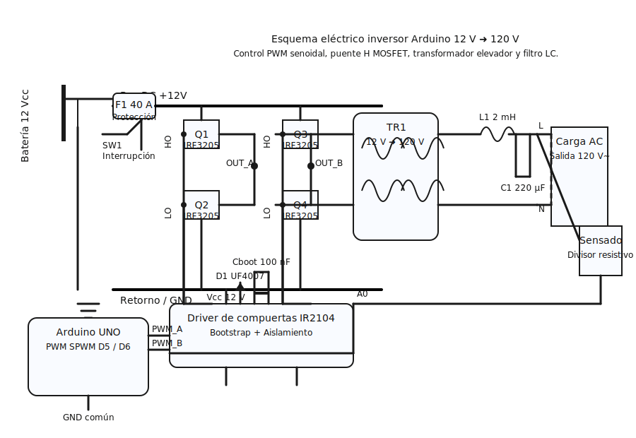

# Esquema eléctrico inversor Arduino 12 V ➜ 120 V

## Descripción general
- **Entrada DC**: batería de 12 Vcc protegida con fusible F1 (40 A) y un interruptor principal SW1.
- **Etapa de potencia**: puente H con MOSFET IRF3205 conmutados mediante modulación sinusoidal (SPWM).
- **Control**: Arduino UNO genera dos señales PWM complementarias que alimentan al driver IR2104 con red bootstrap.
- **Transformador TR1**: eleva la tensión de 12 V a 120 V~ (o la tensión que se requiera) para la salida.
- **Filtro de salida**: red LC (L1 + C1) que suaviza la forma de onda antes de entregar la energía a la carga.
- **Sensado**: divisor resistivo para retroalimentación de tensión hacia el Arduino (canal A0).

> El archivo `esquema_inversor.svg` contiene la versión vectorial del diagrama para que puedas ampliarlo o editarlo según tus necesidades.
